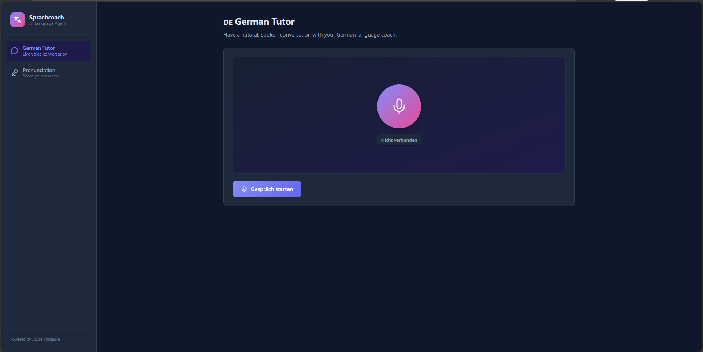
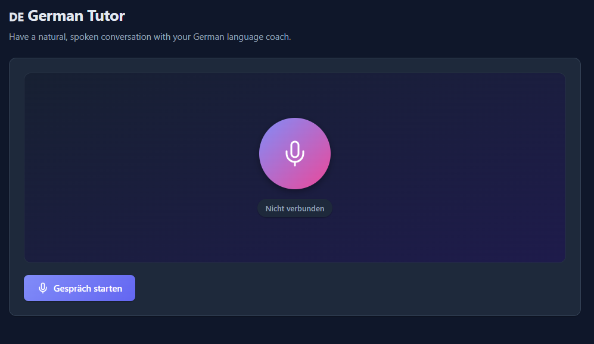
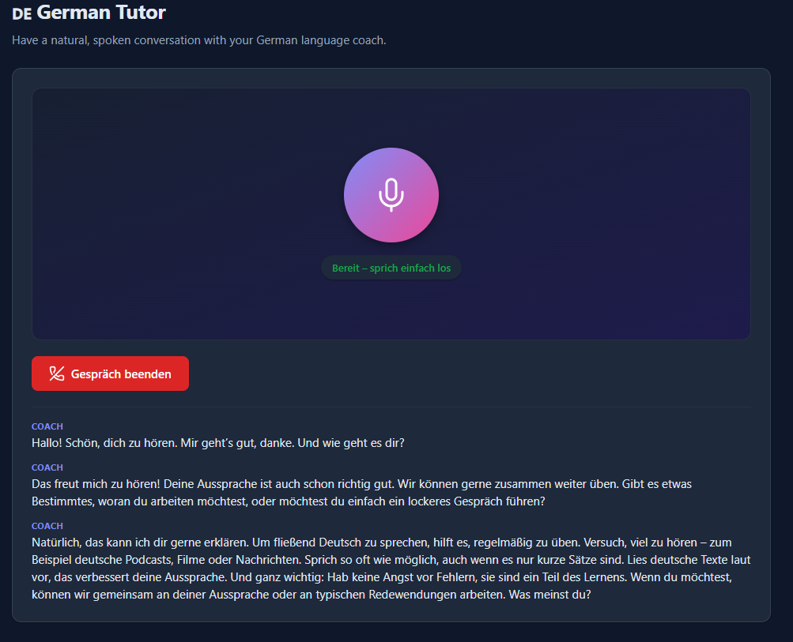

# AI Language Agent — Live German Speaking Coach

**Talk to an AI German tutor in real time, right in your browser.** Speak into your
mic and hear a natural German voice reply within a fraction of a second, interrupt it
mid-sentence like a real conversation, and see a live transcript — all powered by
**Azure AI VoiceLive**. A second mode uses **Azure AI Speech Pronunciation Assessment**
to score your reading aloud and turn the raw numbers into human coaching feedback.

<!-- Screenshot placeholder — see docs/screenshots/README.md -->


---

## Table of Contents

- [Highlights](#highlights)
- [The Live German Voice Agent](#the-live-german-voice-agent) ⭐ main feature
  - [What it does](#what-it-does)
  - [How it works](#how-it-works)
  - [Using it in the web app](#using-it-in-the-web-app)
  - [Wire protocol](#wire-protocol)
  - [Standalone terminal agent (CLI)](#standalone-terminal-agent-cli)
- [Azure Services, in Depth](#azure-services-in-depth)
- [Second Feature: Pronunciation Analysis](#second-feature-pronunciation-analysis)
- [Architecture](#architecture)
- [Repository Layout](#repository-layout)
- [Prerequisites](#prerequisites)
- [Environment Variables](#environment-variables)
- [Run Locally](#run-locally)
- [Deploy to FastAPI Cloud](#deploy-to-fastapi-cloud)
- [Run with Docker](#run-with-docker)
- [Troubleshooting](#troubleshooting)
- [Roadmap](#roadmap)

---

## Highlights

- 🎙️ **Real-time speech-to-speech German tutor** — sub-second spoken replies via **Azure AI VoiceLive** over a WebSocket relay.
- 🗣️ **Natural turn-taking with barge-in** — Azure server-side voice activity detection (VAD) lets you interrupt the agent, just like a real conversation.
- 🧑‍🏫 **Adaptive coaching persona** — a friendly German `Sprachcoach` that adapts to the learner's level and corrects gently (fully configurable via instructions).
- 📊 **Pronunciation scoring** — **Azure AI Speech Pronunciation Assessment** grades accuracy, fluency, prosody, and completeness at word and phoneme granularity.
- 🤖 **AI coaching reports** — assessment numbers are turned into readable, encouraging feedback (Google Gemini).
- ☁️ **One-command full-stack deploy** — a single FastAPI app serves both the API and the built React SPA (ready for **FastAPI Cloud**).

---

## The Live German Voice Agent

This is the heart of the project: a **live, two-way spoken conversation** with an AI
German coach, running entirely in the browser with the server acting as a secure relay
to **Azure AI VoiceLive**.

<!-- Screenshot placeholders -->
| Idle | Live conversation |
| --- | --- |
|  |  |


### What it does

- **Speak naturally in German** and get a spoken reply in a natural Azure neural voice (default `de-DE-KatjaNeural`).
- **Interrupt anytime (barge-in)** — start talking and the agent stops, listens, and responds to you.
- **Live status** — the UI reflects the conversation state: `Bereit` → `Ich höre zu…` → `Denke nach…` → `Spricht…`.
- **Live transcript** — the assistant's turns are transcribed into the conversation panel.
- **Adaptive coaching** — the agent behaves as a patient German tutor, adjusting to the learner and offering brief corrections. Change its behavior with a single instruction string.

### How it works

The browser captures the mic and plays the reply; the FastAPI server is a **stateless
relay** that shuttles audio and control events between the browser and Azure AI VoiceLive.
No audio is stored.

```text
 ┌─────────── Browser ───────────┐         ┌────────── FastAPI server ──────────┐        ┌──── Azure AI ────┐
 │ mic ─► Web Audio ─► PCM16 24k ─┼─ WS ───►│ /api/voice/live  ─► VoiceLiveBridge ┼─ WS ──►│  VoiceLive       │
 │ speaker ◄─ scheduled playback ◄┼─ WS ────┤            (audio + status relay)   ◄┼─ WS ──┤  (STT+LLM+TTS)   │
 └────────────────────────────────┘         └─────────────────────────────────────┘        └──────────────────┘
```

1. **Capture** — the browser records the microphone with the Web Audio API and streams **raw PCM16, mono, 24 kHz** as binary WebSocket frames.
2. **Relay up** — the FastAPI bridge ([`app/services/voicelive_bridge.py`](app/services/voicelive_bridge.py)) forwards those frames to Azure AI VoiceLive using the `azure-ai-voicelive` SDK.
3. **Understand + respond** — Azure runs speech recognition, the language model, and neural text-to-speech, and streams the spoken reply back.
4. **Relay down** — the bridge forwards the reply audio (PCM16) to the browser, which schedules it for **gapless playback**; assistant transcripts are sent as JSON.
5. **Turn-taking** — Azure **server VAD** detects when you start/stop speaking. Speaking over the agent triggers **barge-in**: the current response is cancelled and queued audio is flushed.

### Using it in the web app

1. Set the VoiceLive environment variables (see [Environment Variables](#environment-variables)) and start the backend + frontend.
2. In the sidebar, open **German Tutor**.
3. Click **Gespräch starten**, allow microphone access, and start speaking German.
4. Click **Gespräch beenden** to end the session.

> **Microphone requires a secure context.** Browsers only grant mic access on `localhost` or over **HTTPS**. Local dev on `localhost` works out of the box; any deployed instance must be served over HTTPS.

### Wire protocol

Between the browser client ([`voiceLiveClient.ts`](frontend/src/services/voiceLiveClient.ts))
and the server bridge:

- **Browser → Server:** binary frames — raw PCM16 mono @ 24 kHz microphone audio.
- **Server → Browser:**
  - binary frames — raw PCM16 mono @ 24 kHz audio to play back.
  - text frames (JSON) — control/status events:
    - `{"type": "status", "state": "connected" | "ready" | "listening" | "processing" | "speaking"}`
    - `{"type": "speech_started"}` — barge-in signal; the client flushes queued playback.
    - `{"type": "transcript", "role": "assistant", "text": "..."}`
    - `{"type": "error", "message": "..."}`

### Standalone terminal agent (CLI)

For quick local testing without the frontend, a CLI in
[`app/services/german_voice_agent.py`](app/services/german_voice_agent.py) captures and
plays audio directly on your machine with PyAudio.

PyAudio is an **optional** dependency (it needs the PortAudio system library and is not
used by the web app), so install it via the `cli` extra first:

```bash
uv sync --extra cli
uv run python -m app.services.german_voice_agent
```

Or with explicit flags:

```bash
uv run python -m app.services.german_voice_agent \
  --voice de-DE-KatjaNeural \
  --model gpt-realtime \
  --instructions "Du bist ein freundlicher deutscher Sprachcoach."
```

Press `Ctrl+C` to exit. Use `--use-token-credential` for Microsoft Entra auth instead of
an API key, and `--verbose` for debug logging.

> The CLI reads its **own** environment variables — `AZURE_VOICELIVE_API_KEY`,
> `AZURE_VOICELIVE_ENDPOINT`, `VOICELIVE_MODEL`, `VOICELIVE_VOICE`, and
> `VOICELIVE_INSTRUCTIONS`. Note the `VOICELIVE_*` names differ from the
> `AZURE_VOICELIVE_*` names used by the web app.

---

## Azure Services, in Depth

This project is built around **Azure AI**. Two services do the heavy lifting.

### 1. Azure AI VoiceLive — real-time speech-to-speech (the tutor)

[Azure AI VoiceLive](https://learn.microsoft.com/azure/ai-services/speech-service/voice-live)
is a low-latency, WebSocket-based API that combines speech-to-text, a language model, and
neural text-to-speech into a single real-time voice session. This app uses it for the
German Tutor.

- **Session model** — the app opens one VoiceLive session per browser conversation and configures it with a `session.update` event (persona instructions, voice, audio formats, turn detection).
- **Model** — defaults to **`gpt-realtime`** (configurable via `AZURE_VOICELIVE_MODEL`).
- **Voice (neural TTS)** — the spoken output uses an **Azure neural voice**; default **`de-DE-KatjaNeural`** (any Azure `azure-standard` voice works, e.g. `de-DE-ConradNeural`). Configurable via `AZURE_VOICELIVE_VOICE`.
- **Turn detection (VAD)** — uses **Server VAD** to detect start/stop of speech, enabling natural turn-taking and **barge-in** (interrupting the agent). Audio formats are PCM16 in and out.
- **Endpoint** — a Microsoft Foundry / Azure AI Services resource: `https://<your-resource>.services.ai.azure.com/`.
- **Authentication** — an **API key** (`AZURE_VOICELIVE_API_KEY`) or, if omitted, **Microsoft Entra ID** via `DefaultAzureCredential` (managed identity, environment credentials, or `az login`).
- **SDK** — the backend uses the official **`azure-ai-voicelive`** Python SDK (async client).

### 2. Azure AI Speech — Pronunciation Assessment (the scorer)

[Azure AI Speech Pronunciation Assessment](https://learn.microsoft.com/azure/ai-services/speech-service/how-to-pronunciation-assessment)
evaluates recorded speech against a reference text and returns detailed scores. This app
uses it for the Pronunciation view.

- **Scores** — overall pronunciation, **accuracy**, **fluency**, **prosody** (intonation/stress), and **completeness**.
- **Granularity** — word-level and phoneme-level detail, so specific mispronounced words/sounds can be surfaced.
- **Miscue detection** — flags insertions and omissions against the reference text.
- **SDK** — the backend uses **`azure-cognitiveservices-speech`**; audio is normalized to 16 kHz mono WAV before assessment.
- **Authentication** — a Speech resource **key + region** (`AZURE_SPEECH_KEY`, `AZURE_SPEECH_REGION`).

### AI coaching reports (Google Gemini)

Raw assessment numbers are passed to **Google Gemini** ([`app/services/AI_service.py`](app/services/AI_service.py))
to generate an encouraging, human-readable coaching report (summary, strengths,
weaknesses, recommendations). Configured with `GOOGLE_API_KEY`.

---

## Second Feature: Pronunciation Analysis

Read a script aloud (or upload a recording) and get scored on accuracy, fluency, and
prosody, plus an AI coaching report.

<!-- Screenshot placeholder -->


> _Screenshot placeholder: add `docs/screenshots/pronunciation.png`._

- Assess from **text** (practice input) or from **uploaded/recorded audio**.
- Uploaded audio is converted to 16 kHz mono WAV (via `ffmpeg`) before assessment.
- Returns both machine-readable scores and a readable AI coaching report.

---

## Architecture

- **Backend** — FastAPI. Serves the REST API, the two WebSocket endpoints (live voice + streaming assessment), and — in production — the built frontend as static files (`app.frontend()`), so a single deployment serves everything.
- **Azure integration** — `azure-ai-voicelive` (live tutor) and `azure-cognitiveservices-speech` (pronunciation), plus Google Gemini for narrative reports.
- **Frontend** — React + TypeScript + Vite. Sidebar navigation between **German Tutor** and **Pronunciation** views, with a Web Audio pipeline for real-time mic capture and playback.
- **Same-origin by design** — the frontend calls the API/WebSocket via relative `/api` URLs, so it works whether served by FastAPI (production) or the Vite dev server (which proxies `/api` to the backend).

## Repository Layout

```text
.
├── app/
│   ├── main.py                        # FastAPI app: REST + WebSocket routes + serves the built SPA
│   ├── config.py                      # Environment-driven settings (Speech + VoiceLive)
│   ├── models/                        # Pydantic request/response models
│   ├── services/
│   │   ├── voicelive_bridge.py        # ⭐ Browser <-> Azure VoiceLive relay (live tutor)
│   │   ├── german_voice_agent.py      # Standalone terminal voice agent (CLI)
│   │   ├── azure_pronunciation.py     # Azure Speech pronunciation assessment
│   │   └── AI_service.py              # Gemini coaching report generation
│   └── utils/                         # Shared helpers
├── frontend/
│   ├── src/
│   │   ├── components/
│   │   │   ├── GermanVoiceChat.tsx     # ⭐ Live conversation UI (German Tutor)
│   │   │   ├── Sidebar.tsx             # App navigation
│   │   │   └── PronunciationView.tsx   # Pronunciation scoring UI
│   │   └── services/
│   │       ├── voiceLiveClient.ts      # ⭐ Browser audio capture/playback + WS client
│   │       └── api.ts                  # REST client
│   └── vite.config.ts                 # Dev server + /api proxy
├── docs/screenshots/                  # README images (see its README)
├── Dockerfile                         # Backend container build
├── docker-compose.yml                 # Full-stack local orchestration
├── .fastapicloudignore                # Re-includes frontend/dist for cloud deploys
└── pyproject.toml                     # Python dependencies and project metadata
```

## Prerequisites

- Python 3.12+ and [uv](https://docs.astral.sh/uv/)
- Node.js 20+
- **Azure AI VoiceLive** resource (for the German Tutor) — a Microsoft Foundry / Azure AI Services resource
- **Azure AI Speech** resource key + region (for pronunciation)
- Optional: a **Google Gemini** API key (for coaching reports)
- Optional: Docker Desktop; `ffmpeg` for pronunciation audio conversion

## Environment Variables

Create a `.env` file in the repository root.

**Live German tutor (Azure AI VoiceLive):**

```env
AZURE_VOICELIVE_API_KEY=your_voicelive_key
AZURE_VOICELIVE_ENDPOINT=https://your-resource-name.services.ai.azure.com/
AZURE_VOICELIVE_MODEL=gpt-realtime
AZURE_VOICELIVE_VOICE=de-DE-KatjaNeural
# Optional — customize the tutor persona:
AZURE_VOICELIVE_INSTRUCTIONS=Du bist ein freundlicher deutscher Sprachcoach ...
```

If `AZURE_VOICELIVE_API_KEY` is omitted, the backend falls back to **Microsoft Entra ID**
(`DefaultAzureCredential`).

**Pronunciation analysis (Azure AI Speech):**

```env
AZURE_SPEECH_KEY=your_azure_speech_key
AZURE_SPEECH_REGION=your_azure_region
```

**AI coaching report (optional):**

```env
GOOGLE_API_KEY=your_google_api_key
```

> The app **boots even if some credentials are missing** — each feature only fails when
> actually used. So you can run the German Tutor without Speech credentials, and vice versa.

## Run Locally

**Backend** (serves the API + WebSockets on port 8000):

```bash
uv sync
uv run uvicorn app.main:app --reload --host 0.0.0.0 --port 8000
```

**Frontend** (Vite dev server on port 5173, proxies `/api` → backend):

```bash
cd frontend
npm install
npm run dev
```

Open http://localhost:5173 and use the **German Tutor** from the sidebar.

## Deploy to FastAPI Cloud

A single FastAPI app serves both the API and the built React SPA, so one deployment runs
the whole product. FastAPI Cloud packages and uploads your **local** files (no GitHub push
required) and runs the Python build in the cloud — it does **not** run your frontend build,
so build the frontend first.

```powershell
# On Windows PowerShell, enable UTF-8 so the CLI's emoji output doesn't crash:
$env:PYTHONUTF8=1

uv run fastapi login                 # one-time browser auth
cd frontend; npm run build; cd ..    # build the SPA (rebuild before every deploy)
uv run fastapi deploy
```

Notes:

- `frontend/dist` is git-ignored; [`.fastapicloudignore`](.fastapicloudignore) re-includes it so it uploads.
- **Set your secrets in the FastAPI Cloud dashboard** (`.env` is not uploaded): `AZURE_VOICELIVE_API_KEY`, `AZURE_VOICELIVE_ENDPOINT`, `AZURE_SPEECH_KEY`, `AZURE_SPEECH_REGION`, `GOOGLE_API_KEY`, and any overrides.
- **`ffmpeg` caveat** — the pronunciation *audio-upload* endpoints shell out to `ffmpeg`, which isn't in the cloud runtime. The **voice tutor** and **text** endpoints don't need it.

## Run with Docker

For local full-stack runs, `docker-compose.yml` builds the backend and an Nginx-served
frontend:

```bash
docker compose up --build
```

- Frontend: http://localhost:3000
- Backend health check: http://localhost:8000/health

## API Overview

- `GET /health` — service health check
- `GET /api/config` — available modes, languages, proficiency levels
- `POST /api/assess/text` — assess pronunciation from text input
- `POST /api/assess/audio` — assess pronunciation from an uploaded audio file
- `POST /analyze` — alternative audio analysis endpoint
- `POST /analyze-with-reference` — analyze learner audio against a reference file
- `WebSocket /api/assess/stream` — streaming pronunciation assessment
- **`WebSocket /api/voice/live`** — ⭐ live German voice conversation (Azure VoiceLive relay)

## Troubleshooting

- **Voice agent connects but you hear nothing** — make sure the page was reloaded after granting mic permission; playback runs through a Web Audio context that must be started by the **Gespräch starten** click.
- **Voice agent won't connect** — verify the VoiceLive endpoint, key, and model; the backend log should show `connected` → `ready`. On a deployed instance, confirm it's served over HTTPS and that WebSockets are allowed through any proxy.
- **Pronunciation audio fails** — confirm `ffmpeg` is available and your Azure Speech key/region are set. (In FastAPI Cloud, audio-upload assessment needs an in-process converter — see Roadmap.)
- **AI report is generic** — set `GOOGLE_API_KEY` for Gemini-powered feedback.
- **Cloud "Verification Failed"** — usually a missing credential or a startup error; the app is designed to boot without credentials, so check the deployment's **runtime logs** for the real cause.

## Roadmap

- In-process audio conversion (replace the `ffmpeg` subprocess) so pronunciation audio works on FastAPI Cloud.
- On-screen microphone-level indicator and a connection cap for the voice agent.
- Optional **Azure video avatar** for the tutor (requires WebRTC/TURN connectivity end-to-end).
- Additional target languages and voices.
- CI checks for backend and frontend.
